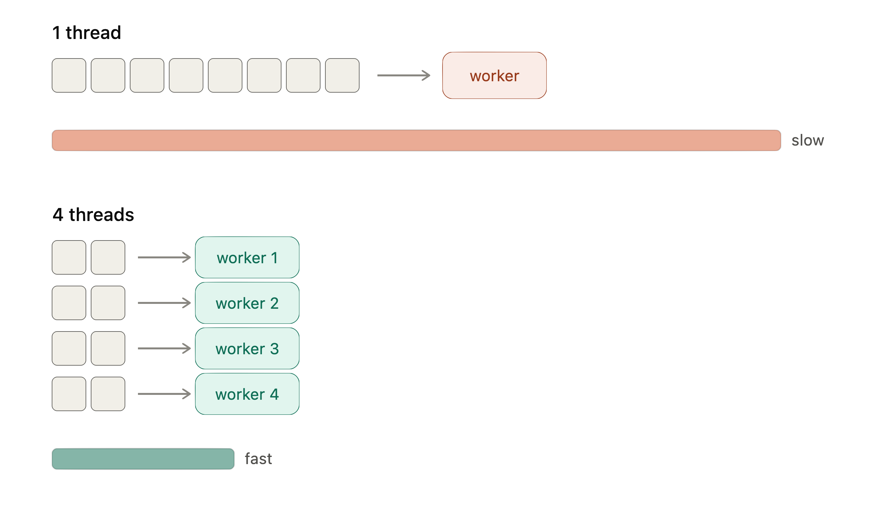

## Objetivos de la clase

Al finalizar esta sesión podrás:

- Entender qué es el alineamiento y por qué es necesario

- Descargar un genoma de referencia y un archivo de anotación

- Construir un índice de STAR

- Alinear lecturas trimmed al genoma de referencia con STAR

- Interpretar los archivos de salida (BAM y matrices de cuentas)

---

## 1. ¿Qué es el alineamiento?

El alineamiento (o mapeo) es el proceso de identificar **a qué posición del genoma** corresponde cada lectura de RNA-seq.

```
Genoma:   ...ATGCTAGCTAGCTAGCTAGCTAGCT...
Lectura:         GCTAGCTAGCTAGCTAGCT
                 |||||||||||||||||||
Mapea en: cromosoma 5, posición 12,345,678
```

Una vez que sabemos a qué gen pertenece cada lectura, podemos **contar** cuántas lecturas vienen de cada gen, esto nos da una medida de expresión génica.

### Tipos de estrategia de alineamiento

| Tipo | Descripción | Ventajas | Desventajas |
|------|-------------|----------|-------------|
| **A genoma de referencia** (STAR, HISAT2) | Las lecturas se mapean al genoma completo | Detecta nuevos transcritos, maneja splicing | Más lento, requiere más recursos |
| **A transcriptoma** (Salmon, Kallisto) | Las lecturas se pseudoalinean al transcriptoma | Muy rápido | No detecta nuevos transcritos |
| **Ensamblaje de novo** (Trinity) | No requiere referencia | Útil en organismos sin referencia | Muy intensivo computacionalmente |

En este curso usaremos **STAR** (alineamiento a genoma de referencia).

---

## 2. Archivos necesarios para el alineamiento

### Genoma de referencia (FASTA)

El genoma de referencia es una secuencia de nucleótidos de todo el genoma del organismo. Se puede descargar de:

- **UCSC Genome Browser:** https://genome.ucsc.edu/

- **GENCODE:** https://www.gencodegenes.org/

- **Ensembl:** https://www.ensembl.org/

```{bash}
# Ejemplo: descargar genoma humano hg38 desde GENCODE
wget https://ftp.ebi.ac.uk/pub/databases/gencode/Gencode_human/release_50/GRCh38.primary_assembly.genome.fa.gz

gunzip -k GRCh38.primary_assembly.genome.fa.gz

# Ejemplo: genoma de ratón mm10 desde UCSC
# (buscar en https://hgdownload.soe.ucsc.edu/goldenPath/mm10/bigZips/)
```


### Archivo de anotación (GTF/GFF)

El archivo GTF (Gene Transfer Format) contiene las coordenadas genómicas de los genes, transcritos y exones anotados. Es esencial para que STAR sepa qué lecturas corresponden a qué gen.

```{bash}
# Ejemplo: descargar anotación de humano desde GENCODE
wget https://ftp.ebi.ac.uk/pub/databases/gencode/Gencode_human/release_44/gencode.v44.primary_assembly.annotation.gtf.gz

# Descomprimir
gunzip gencode.v44.primary_assembly.annotation.gtf.gz
```

**Siempre usa la misma versión del genoma y de la anotación** (ej. ambos de hg38/GRCh38 release 44).

---

## 3. STAR — Spliced Transcripts Alignment to a Reference

STAR es uno de los alineadores más usados para RNA-seq porque:

- Es muy rápido (multi-threading)

- Maneja correctamente el **splicing** del RNA mensajero

- Puede generar matrices de cuentas por gen directamente

[Manual de STAR (PDF)](https://github.com/alexdobin/STAR/blob/master/doc/STARmanual.pdf)

### Instalación

```{bash}
# Con conda
conda install -c bioconda star

# O en un cluster con módulos
module load star/2.7.11a
```

---

## 4. Paso 1: Indexar el genoma

Antes de alinear, STAR necesita crear un **índice** del genoma. Este proceso solo se hace una vez por versión del genoma. El índice permite a STAR buscar posiciones en el genoma de forma eficiente.

```{bash}
# Crear directorio para el índice
mkdir -p rna/STAR_index

# Generar el índice
STAR \
  --runThreadN 12 \
  --runMode genomeGenerate \
  --genomeDir rna/STAR_index \
  --genomeFastaFiles rna/data/GRCh38.primary_assembly.genome.fa \
  --sjdbGTFfile rna/data/gencode.v44.primary_assembly.annotation.gtf \
  --sjdbOverhang 149
```

### Parámetros importantes de indexación

| Parámetro | Descripción |
|-----------|-------------|
| `--runThreadN` | Número de CPUs a usar |
| `--runMode genomeGenerate` | Indica que vamos a crear un índice |
| `--genomeDir` | Carpeta donde se guardará el índice |
| `--genomeFastaFiles` | Archivo FASTA del genoma de referencia |
| `--sjdbGTFfile` | Archivo GTF de anotación |
| `--sjdbOverhang` | Longitud de lectura - 1 (si lecturas son 150 pb → 149) |

**Este paso puede tomar 30–60 minutos y requiere ~30 GB de RAM.**

### Multi-threading



---

## 5. Paso 2: Alinear lecturas con STAR

```{bash}
# Crear carpeta de salida
mkdir -p rna/STAR_output

# Variables de ruta
INDEX=rna/STAR_index
TRIM_DIR=rna/TRIM_results
OUT_DIR=rna/STAR_output

# Loop de alineamiento
for f in $TRIM_DIR/*_1_trimmed.fq.gz; do
  base=$(basename "$f" _1_trimmed.fq.gz)
  echo "Alineando: $base"

  STAR \
    --runThreadN 12 \
    --genomeDir $INDEX \
    --readFilesIn "$f" "$TRIM_DIR/${base}_2_trimmed.fq.gz" \
    --outSAMtype BAM SortedByCoordinate \
    --quantMode GeneCounts \
    --readFilesCommand zcat \
    --outFileNamePrefix "$OUT_DIR/${base}"
done
```

### Parámetros importantes de alineamiento

| Parámetro | Descripción |
|-----------|-------------|
| `--readFilesIn` | Los dos archivos FASTQ (read1 y read2) |
| `--outSAMtype BAM SortedByCoordinate` | Salida en formato BAM ordenado por posición |
| `--quantMode GeneCounts` | Genera archivo de cuentas por gen |
| `--readFilesCommand zcat` | Para leer archivos comprimidos `.gz` |
| `--outFileNamePrefix` | Prefijo para los archivos de salida |

---

## 6. Archivos de salida de STAR

Para cada muestra, STAR genera varios archivos:

```
STAR_output/
├── SRR12363092Aligned.sortedByCoord.out.bam   # Lecturas alineadas
├── SRR12363092Log.final.out                    # Estadísticas de alineamiento
├── SRR12363092Log.out                          # Log del proceso
├── SRR12363092ReadsPerGene.out.tab             # Matriz de cuentas por gen, usaremos este
└── SRR12363092SJ.out.tab                       # Junctions de splicing
```

### El archivo `ReadsPerGene.out.tab`

Este archivo tiene 4 columnas:

| Columna | Descripción |
|---------|-------------|
| 1 | ID del gen |
| 2 | Cuentas para RNA-seq no strandado |
| 3 | Cuentas strand 1 (htseq -s yes) |
| 4 | Cuentas strand 2 (htseq -s reverse) |

```{bash}
# Ver las primeras líneas del archivo
head SRR12363092ReadsPerGene.out.tab
```

```
N_unmapped        342365   342365   342365
N_multimapping   1101670  1101670  1101670
N_noFeature       526456   524456   523456
N_ambiguous        12345    12345    12345
ENSMUSG00000051951    0        0        0
ENSMUSG00000025900   45       23       22
```

Las primeras 4 líneas son estadísticas globales (no genes). Los genes comienzan en la línea 5.

**¿Qué columna usar?** Depende del tipo de librería. En la mayoría de los kits de Illumina actuales, se usa la **columna 2** (unstranded) o la **columna 4** (stranded reverse). Revisa el protocolo de tu experimento o consulta la documentación del kit.

### El archivo `Log.final.out`

Revisa siempre las estadísticas de alineamiento:

```{bash}
cat SRR12363092Log.final.out
```

Busca:

- **% of reads mapped:** Debe ser > 70-80% en muestras de buena calidad

- **% of uniquely mapped:** Idealmente > 60%

- **% of multi-mapped:** Depende del organismo, algo de multimapping es normal

---

## 7. Resumen de la pipeline hasta ahora

```
data/ (FASTQs crudos)
    | FastQC + MultiQC
quality1/ (reportes pre-trimming)
    |  Trimmomatic
TRIM_results/ (FASTQs limpios)
    |  FastQC + MultiQC
quality2/ (reportes post-trimming)
    |  STAR (indexar + alinear)
STAR_output/ (BAMs + cuentas por gen)
```

---

## Estado de la carpeta al final de esta clase

```
rna/
├── data/
├── quality1/
├── quality2/
├── TRIM_results/
├── STAR_index/
│   ├── Genome
│   ├── SA
│   └── ...
└── STAR_output/
    ├── SRR12363092Aligned.sortedByCoord.out.bam
    ├── SRR12363092Log.final.out
    ├── SRR12363092ReadsPerGene.out.tab
    └── ...
```

---

## Recursos

- [Manual de STAR (GitHub)](https://github.com/alexdobin/STAR/blob/master/doc/STARmanual.pdf)

- [GENCODE (genomas humano y ratón)](https://www.gencodegenes.org/)

- [UCSC Genome Browser](https://genome.ucsc.edu/)

- [Paper de STAR (Dobin et al. 2013)](https://doi.org/10.1093/bioinformatics/bts635)
